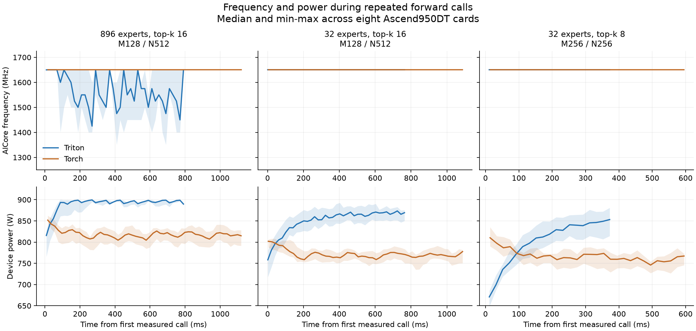

# Kimi K3 未裁剪 forward 性能分析（2026-09-25）

在 8 × Ascend950DT、CANN 9.2.0-beta.2、UDMA 虚拟环境下，完整 Kimi
E896/top-k=16 的 fused forward 从本机复现 PR #68 的 17.655 ms 优化到
实测约 15.1–15.5 ms。当前源码按标准协议复测为 15.095 ms，相对同次
Torch 基线为 1.437×；归约改动的同进程交替对照为 15.242 ms、1.423×。
此前 Pipe profile 配套测量为 15.130 ms、1.442×。
PR #68 尚未合入；
本 worktree 基于 origin/main `eb737e7`，包含 PR #68 的五个 cherry-pick，末个为
`7074180`，本轮改动叠加其上。**完整版尚未达到 1.6×。**

此前直接与裁剪版 1.6× 比较遗漏了 top-k 差异：历史裁剪用例 E32/top-k=8，
完整版 E896/top-k=16。固定 token、hidden、FFN 后，后者的路由行数和 GEMM
有效计算量仍是前者的两倍。补测同 top-k 后，裁剪版也低于 1.6×。

## 相同计时边界下的结果

均为每 rank 4096 tokens、hidden=3584、FFN=3072；5 次预热、50 次 NPU event
采样，每个样本取 8 个 rank 的 MAX。计时从 router/top-k 之后开始，包含完整
forward，包括 PR #68 的 host 发起的 `route_to_send.fill_(-1)`。这里的
“fused forward”耗时包含这个额外 fill，不能当作仅 fused kernel 本体耗时。

| 实现/用例 | 专家数 | top-k | FC1 / FC2 M,N,K | Triton median | Torch median | 加速比 |
| --- | ---: | ---: | --- | ---: | ---: | ---: |
| PR #68，本机复现 | 896 | 16 | 256,256,128 / 同左 | 17.655 ms | 21.782 ms | 1.234× |
| 本轮完整版，归约改动前 Pipe profile 配套 | 896 | 16 | 128,512,128 / 同左 | 15.130 ms | 21.812 ms | 1.442× |
| 本轮完整版，归约交替对照 | 896 | 16 | 128,512,128 / 同左 | 15.242 ms | 21.688 ms | 1.423× |
| 本轮完整版，保存分支兼容处理后的复测 | 896 | 16 | 128,512,128 / 同左 | 15.095 ms | 21.697 ms | 1.437× |
| 历史裁剪用例，本轮实现 | 32 | 8 | 256,256,128 / 同左 | 6.925 ms | 11.698 ms | 1.689× |
| 裁剪版，同 top-k | 32 | 16 | 256,256,128 / 同左 | 14.307 ms | 21.306 ms | 1.489× |
| 裁剪版，同 top-k、同 tile | 32 | 16 | 128,512,128 / 同左 | 14.637 ms | 21.300 ms | 1.455× |
| 历史裁剪用例，最终归约改动后 | 32 | 8 | 256,256,128 / 同左 | 6.841 ms | 11.642 ms | 1.702× |

15.130 ms 那组的 mean=15.094 ms、P95=15.357 ms。P95 使用 50 个 rank-MAX 样本的
线性插值。采样值、配置、正确性状态和实验目录见
[测量记录](performance/kimi-forward-2026-09-25.json)。

归约改动前的同 top-k、同 tile 对照中，完整版比裁剪版多 0.493 ms（约 3.4%），加速比分别是
1.442× 和 1.455×。不能把历史 top-k=8 的加速比直接当作只改变专家数的对照。
使用各自较好的 tile 时，完整版仍比 top-k=16 裁剪版多 0.823 ms。
按本轮 Torch 21.812 ms 计算，达到 1.6× 需要降到约 13.633 ms。

只看 E32、两阶段 M256/N256 的对照，top-k 从 8 增加到 16 时，fused 耗时
增长 2.066×，Torch 耗时增长 1.821×，因此相对加速比从 1.689× 降至
1.489×。这部分下降在专家数不变时就存在，不能全部归因于未裁剪专家。

同一保留代码在后续 L2 profile 配套 benchmark 中，完整版复测为
15.478 ms（Torch 21.725 ms，1.404×），同 top-k、同 tile 的裁剪版为
14.644 ms（Torch 21.228 ms，1.450×）。完整版存在运行间波动，15.130 ms
是此前 Pipe profile 配套的测量值，不能保证每次复现都达到该数值。

## 已验证的原因和改动

完整路由有 896 个专家、每 rank 112 个本地专家。实测接收行数每专家为
515–657，中位数 585；每个 source/expert bucket 平均仅 73.14 行，7168 个
bucket 全部非空，且均只占一个 256 行 dispatch tile。历史裁剪用例只有 256 个
非空 source/expert bucket，平均 1024 行；top-k=16 的裁剪对照平均为 2048 行。

1. **小 bucket 的 dispatch 串行化。** 原调度总把第一个 source tile 分给同一
   peer 的 lane 0。一个 bucket 只有一个 tile 时，其余 lane 无数据可发。
   现在仅对单 tile bucket 按专家号轮转 worker；大 bucket 保留原分配。
   在已有 full-row/idle-core 改动上，median 从 16.046 ms 降至复测的
   15.185 ms，最终 profile 配套 benchmark 为 15.130 ms。
2. **尾块填充及加载分支。** 完整场景用 M256 时，实际 524288 个有效路由行
   要计算 688128 个 tile 行，填充开销为 31.25%；M128 降为 9.62%。历史裁剪
   场景 M256 的填充开销只有 1.46%。FC1 原来仅在整个 wave 属于一个完整专家组
   时走无 mask 路径；现在单个 row tile 满行也走该路径，并跳过没有 FC1 tile
   的 core 的 helper 初始化。保留尾行 mask 和原有数值语义。
3. **dispatch tile 与 GEMM tile 分开配置。** 新增 fused 路径的 dispatch M，
   默认 256，`None` 沿用 legacy dispatch M。共享 workspace 按二者的较小值
   分配 signal slots，确保切换路径或使用更小 fused tile 不越界。compile-only
   入口也按相同规则计算 signal stride。
4. **减少末尾 return 检查。** 每个 return worker 按 wave 顺序执行，写入后
   fence 再发布 counter；等待所有 worker 的最后一个 wave 即覆盖它们之前的
   return 写入。保留原逐 wave 模式用于对照，并测试空 destination、未完成
   counter、旧 epoch 和宽 world。该项单独收益较小。
5. **末尾 top-k 合并使用四条 FP32 累加链。** 保持逐路连续 DMA 读取，
   将累加依赖拆开后再求和。独立归约测试从 0.278 ms 降至 0.230 ms。
   同一进程中交替执行 50 组 AB/BA 完整 forward，原版/新版 median 为
   15.336/15.242 ms，配对差值 median 为 0.091 ms；50 对中有 28 对新版更快，
   端到端收益较小且存在波动。FP32 加法顺序发生变化，完整硬件正确性门使用
   原有容差通过；84 项主机测试覆盖非 4 倍数 top-k、负路由、空输入、容量失败
   和尾列掩码。

保存 FC1 原始输出的分支保留单条累加链。四条累加链与 BF16 保存分支组合时，
compile-only 超过 300 秒；相同环境、相同参数下，旧归约版本和恢复单链后的
保存分支均编译成功。该兼容分支与并行归约各有 84 项主机用例，均通过。
这项编译回归没有影响已实测的普通 forward，不能解释为 CANN 版本错误。

完整权重工作集每 rank 约 7.399 GB，裁剪版约 0.264 GB。它与更频繁的专家切换、
尾块和同步共同增加代价，不能仅由汇总 PMU 指标为每项分摊剩余 0.493 ms。

## Profile 与环境核对

本机成功运行环境固定为 `/home/vllm_kimiw/.venv-udma`，CANN 为
`/usr/local/Ascend/cann-9.2.0-beta.2`。实际 `libruntime.so` 来自这个目录，
包含 `rtsGetHardwareSyncAddr` 符号。使用完整启动环境已复现 PR #68 并通过
正确性门，不能把早先环境未对齐时的异常当作当前算子无法在硬件上运行的证据。
当前源码复测时，再次采样到七个测试进程的 runtime 路径，均来自同一 CANN
9.2.0-beta.2 目录，且 `TRITON_DISABLE_FFTS=1`。路径、环境和源码指纹随
测量记录保存。

最终 PyTorch/CANN PipeUtilization profile：完整 fused kernel 的 AIC MAC ratio
中位数约 81.95%，Cube utilization 约 97.22%；两者分母不同，后者不能解释为
97% 时间都在做有效 MAC。routing SYS_CNT 对照中 metadata 约 0.23 ms，主要
时间仍在 wave pipeline。FC1/FC2 的 wall 打点包含依赖等待，不能当作纯 GEMM。

同次 profile 首个样本的 rank 间 kernel 启动跨度约 0.952 ms，结束跨度仅
0.048 ms；第二个样本启动跨度约 0.164 ms。启动偏差会形成跨卡等待，但只有
两个 profile 样本，不能直接从 benchmark 中减去一个固定的 launch 开销。

补充相同 top-k、相同 tile 的 L2 对照，每组为 8 rank × 2 个 kernel 样本。
工具导出的 Victim Rate 中位数为完整版 11.69%、裁剪版 7.45%；Cube 本地
L2 read-miss 原始计数中位数分别为 20.38M、7.05M。`l2_cache.csv` 的
Hit Rate 为 N/A，不能把这些计数直接称为整体缓存命中率。该轮两组 kernel
duration 的中位数分别为 14.002 ms、14.213 ms，与端到端 benchmark 的大小
顺序不同；缓存指标能说明缓存行为差异，不能单独证明端到端差额由缓存导致。
逐 rank 的原始计数和采样值一并保存在测量记录中。

额外记录连续测量期间的频率和功耗后，发现完整版确有降频。使用驱动 DCMI v2
只读接口约每 20 ms 采样一次，并按 host 调用的单调时钟对齐测量区间；计时仍是
5 次预热、50 次 NPU event，所有用例均先通过三类正确性门。以下是采样点汇总，
并非对每个 kernel 的周期积分，也没有修改频率或功耗设置。

| 用例 | M/N | Triton median | 加速比 | Triton 频率中位数 | Triton 功耗中位数 | Torch 频率中位数 |
| --- | --- | ---: | ---: | ---: | ---: | ---: |
| E896/top-k=16，32 核 | 128/512 | 15.211 ms | 1.443× | 1550 MHz | 894.7 W | 1650 MHz |
| E32/top-k=16，32 核 | 128/512 | 14.626 ms | 1.452× | 1650 MHz | 855.8 W | 1650 MHz |
| E32/top-k=16，32 核 | 256/256 | 14.206 ms | 1.479× | 1650 MHz | 876.1 W | 1650 MHz |
| E32/top-k=8，32 核 | 256/256 | 6.849 ms | 1.670× | 1650 MHz | 815.4 W | 1650 MHz |

完整版测量期采样到的频率为 1350–1650 MHz，320 个采样点中有 201 个低于
1650 MHz；同轮 Torch 的 448 个采样点均为 1650 MHz。相同 top-k、相同分块的
裁剪版 Triton 的 312 个采样点也均为 1650 MHz。这支持降频是完整场景持续运行
性能的一项影响因素，并与其最初约 14.1 ms、随后约 15.1 ms 的样本变化一致。
功耗接近 900 W 时频率下降与功耗约束相符，但没有读取或调整配置的功耗上限，
也不能仅由这些采样为剩余差额作精确归因。top-k 增加后的固定开销占比变化，
以及专家切换、尾块和缓存差异仍然存在。



图中实线为同一轮采样八张卡的中位数，阴影为最小值到最大值；Triton 和 Torch
各自对齐其首个计时调用。诊断副本只在调用外围记录 host 时间，用于关联驱动
采样；这些带监控的测量不替代上面的普通 benchmark。首次低频率 `npu-smi`
采样在获得测量区间数据后遇到查询超时；上表使用随后完成的 DCMI v2 采样。

为了检查降低并行度是否改善降频，另测 28/30 核。两者正确性通过、采样频率
中位数提高到 1650 MHz，但完整 forward 分别变慢到 16.098/16.499 ms，
未接入生产实现。当前仍使用全部 32 核。

将 FC2 的完成检查改为单个 Vector 检查并中继的实验正确性通过，但完整耗时为
15.372 ms、加速比 1.412×，采样功耗中位数仍约 895 W，没有显示收益，未接入。
直接把所有 Cube 的完成发布合并为一个 ADD counter 的实验停在首轮正确性调用，
超过 120 秒后终止，没有性能结果；具体失败原因未确定。两种实验都只存在于
`/tmp/kimi_forward_perf`，正式实现继续使用原有逐 Cube 完成发布和检查。

独立 FC1 helper 的 128/585/2048 行小测试验证了原始 FC1 和激活输出。
`msopprof --aic-metrics=PipeTimeline` 虽报告成功，实际产物没有 `timeline.bin`
或 TRACE 数据块，只有基础耗时，不能据此声称获得了流水事件。
补采 `Default,PipeTimeline` 后获得了 PMU 表，但仍没有流水事件。
112 个专家、每专家 585 行的独立 FC1 测试中，core 0 的 Cube ratio 为
91.42%，MTE2 ratio 为 96.70%。这个测试没有远端通信，不能代替完整 8 卡 profile。

未保留无收益或错误的实验：短 dispatch 循环、FC2 N256、扩大 return chunk、
尾块边界读取、FC1 任务分组等；gate/up 合并的独立数值测试失败，已恢复原路径。
M64/N1024 的 UB 溢出可通过减小激活临时块避免，但 K128 的正确版本实测
31.662 ms，K64 为 22.685 ms，因此也未保留。

进一步的独立多专家测试（112 专家 × 585 行、5 次预热、20 次 event 采样）
中，FC1 原实现为 8.540 ms，合并 Cube 调度块为 8.542 ms，关闭预取为
8.542 ms，K64 为 9.977 ms。将整行/尾行判断移到 K 循环外、分别保留
GEMM 和 Fixpipe 的版本数值正确，但耗时为 10.375 ms，已恢复原实现。
相同输入规模的独立 FC2 测试中，K128/K64/K256 分别为
4.484/5.817/6.579 ms。以上均为局部测试，不能与端到端耗时直接比较或相加。
随后在 FC2 中单独比较七组 M/N/K：当前 128/512/128 为 4.482 ms，
256/256/128 为 4.562 ms，128/256/128 为 4.674 ms，128/256/256 为
4.638 ms，其余更慢。七组均通过三个抽样专家的完整输出数值检查；目前没有
证据支持为 FC2 引入与 FC1 不同的行块配置。
另一个独立 FC1 测试让双缓冲流水连续跨越 112 个专家，抽样专家数值检查通过。
将旧实现的 expert/core 轮转与完整调度对齐后，旧版为 7.740 ms，连续流水为
7.742 ms，没有收益，未接入。前述 8.540 ms 的旧独立测试没有轮转，所以不能
把这两个数的差值当作连续流水带来的加速。
实验日志、脚本和快照均留在 `/tmp/kimi_forward_perf`。

## CANN 与 UDMA 工具链核对

主路径的运行时和编译环境已对齐到 CANN 9.2.0-beta.2：实际进程加载的
`libruntime.so` 来自 `/usr/local/Ascend/cann-9.2.0-beta.2`，标准 forward
正确性门和性能复测均在这套环境完成。因此目前没有证据表明主路径使用了错误的
CANN 版本。

UDMA 实验暴露了另一个更具体的工具链问题。第一次实验虽然激活了
`/home/vllm_kimiw/.venv-udma`，但 PATH 选中了 CANN 目录下的
`bishengir-compile`，并链接了 CANN 目录的 meta-op bitcode；最终缺少
`_mlir_ciface_aclshmemi_udma_put_nbi_bfloat16.vector` 和
`_mlir_ciface_aclshmemx_udma_quiet.vector`。将 PATH 显式切到 UDMA 环境的
`ascendnpuir/bin/bishengir-compile` 及其配套 bitcode 后，同一输入成功编译，
说明那次失败是编译器/设备库混用，不是硬件端限制。

在匹配的 UDMA 工具链下，完整 8 卡原型的 normal、empty 和 all-drop 正确性门
均通过；50 次标准 event 采样得到 fused median=15.829 ms、Torch
median=21.990 ms、加速比 1.389×。它比当前普通回传约 15.1 ms 更慢，故 UDMA
回传原型没有接入生产，也不能作为达到 1.6× 的优化依据。实验输入、编译输出、
环境和结果保留在 `/tmp/kimi_forward_perf/udma_return_matched_toolchain`。

普通回传也用配套 NPU-IR 编译器及独立的新 Triton 缓存重新编译、跑完 8 卡门禁：
median=15.297 ms，Torch=21.996 ms，加速比 1.438×，仍落在此前普通路径的范围内。
在这套工具链下，UDMA 原型比普通回传多约 0.532 ms；上述结果是分次 benchmark，
没有把全部差额归因于某一条指令。两组均未达到 1.6×。
普通路径记录在 `/tmp/kimi_forward_perf/npuir_standard_full`，编译器版本及配套库
指纹在 `/tmp/kimi_forward_perf/npuir_standard_toolchain.json`。后续 benchmark 的
`run_metadata.json` 现在自动记录后端实际选择的编译器、版本、设备库指纹与缓存目录，
不能仅从 `ASCEND_HOME_PATH` 判断完整工具链。

这次定位的是 UDMA 链接错误。现存证据仍不足以确定早先那次
`rtsGetHardwareSyncAddr` 启动异常的具体环境差异，两者不能混为同一个根因。

## 复现

等待 8 张 NPU 空闲。benchmark 自带运行前和运行中的占用检查；输出目录须是
新目录。环境和相同 tile 对照命令如下：

```bash
source /home/vllm_kimiw/.venv-udma/bin/activate
export ASCEND_HOME_PATH=/usr/local/Ascend/cann-9.2.0-beta.2
export ASCEND_TOOLKIT_HOME=/usr/local/Ascend/cann-9.2.0-beta.2
export PATH=/usr/local/Ascend/cann-9.2.0-beta.2/bin:$PATH
export TRITON_BACKENDS_IN_TREE=1
export TRITON_DISABLE_FFTS=1
export TORCH_DEVICE_BACKEND_AUTOLOAD=0
export MOE_FUSED_ASH_SIZE_GB=16
export PYTHONPATH=src:.

python benchmark/layer/profile_single_kernel_forward.py \
  --case performance-fwd-kimi-k3-w8-t4k --benchmark-only \
  --fc1-block 128 512 128 --fc2-block 128 512 128 --dispatch-block 256 \
  --output-dir /tmp/kimi_full_new_run

python benchmark/layer/profile_single_kernel_forward.py \
  --case performance-fwd-kimi-k3-trimmed-top16-w8-t4k --benchmark-only \
  --fc1-block 128 512 128 --fc2-block 128 512 128 --dispatch-block 256 \
  --output-dir /tmp/kimi_trimmed_top16_new_run
```

只有运行 UDMA 实验时还需要把配套编译器放到 PATH 最前面；普通 forward 不需要
这个覆盖：

```bash
export PATH=/home/vllm_kimiw/.venv-udma/lib/python3.11/site-packages/ascendnpuir/bin:$PATH
```

裁剪版自己的较优 tile 是两阶段均 `256 256 128`。历史 top-k=8 的 case 是
`performance-fwd-kimi-k3-trimmed-w8-t4k`；新的 top-k=16 control case 不替换它。
去掉 `--benchmark-only` 可采集 profile。本机离线导出需要的 `libsqlite3.so`
兼容链接保留在 `/tmp/kimi_forward_perf/profiler_libs`，导出前可将该目录加入
`LD_LIBRARY_PATH`。

每次列入表格的 NPU benchmark 都先通过 normal、zero-receive/empty-expert、
negative/out-of-range all-drop 三类正确性门。所有结果包含同一 post-router
forward 边界，没有将 routing、reset 或 combine 移出计时。

主机回归为 **494 passed**，覆盖 routing/scatter、wave 分配、return
可见性接力、workspace 容量、宽 world、JIT 调用绑定、归约寻址/掩码和计时/profile 工具。
Python 语法检查及 `git diff --check` 通过。完整 M128/N512 compile-only 成功，
与共享 workspace 一致的 `MAX_SOURCE_TILES=512`；编译记录在
`/tmp/kimi_forward_perf/final_matched_workspace_compile/compile_result.json`。
该 compile-only 记录属于归约改动前；最终归约实现已在完整与裁剪用例中实际
编译运行，并在计时前通过三类硬件正确性门。
加入保存分支的兼容处理后，归约两种模式和 JIT 调用绑定的针对性回归为
**174 passed**；BF16 保存分支 compile-only 也已通过。
带 SYS_CNT 打点的普通 forward，以及 M128/N256 的 FP8、FP16 保存分支均通过
compile-only。M128/N512 的 FP8 保存分支在旧归约和兼容处理后均未在 300 秒内
编译完成；两者送入 CANN 的 IR 去掉调试位置信息后完全一致。FP16 大分块也在
300 秒后超时，新旧编译输入一致；旧版只捕获了编译输入，未执行最终编译。这些检查不代表
保存输出的硬件数值验证，也不能将保存格式的编译限制归因于运行时版本选错。
